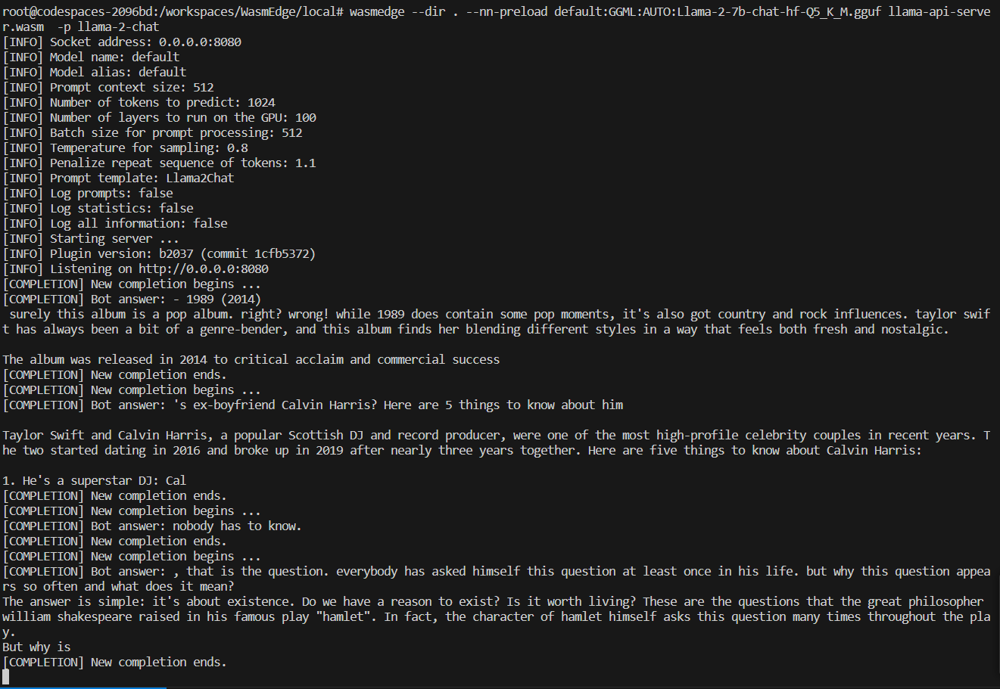
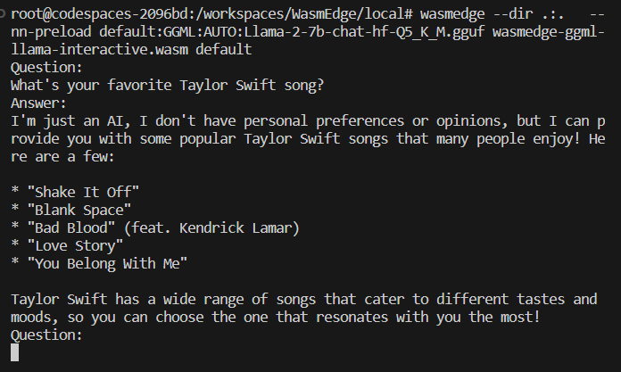
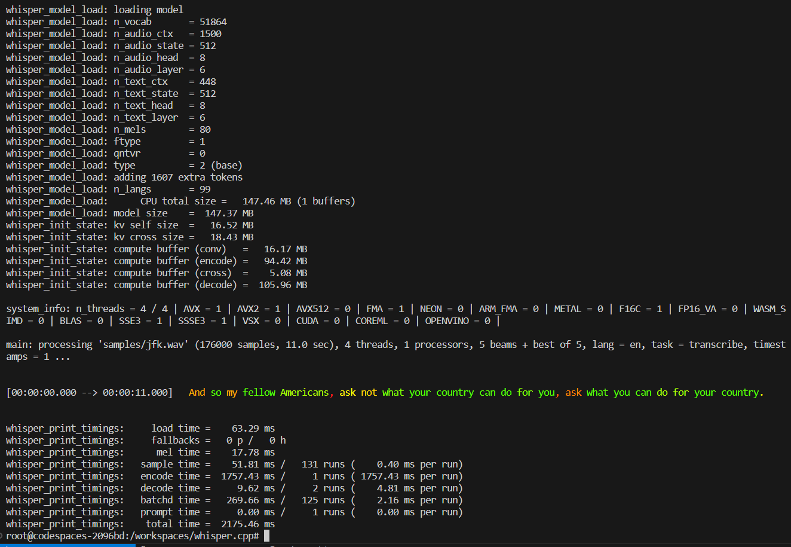
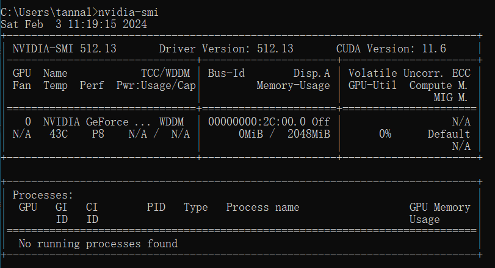
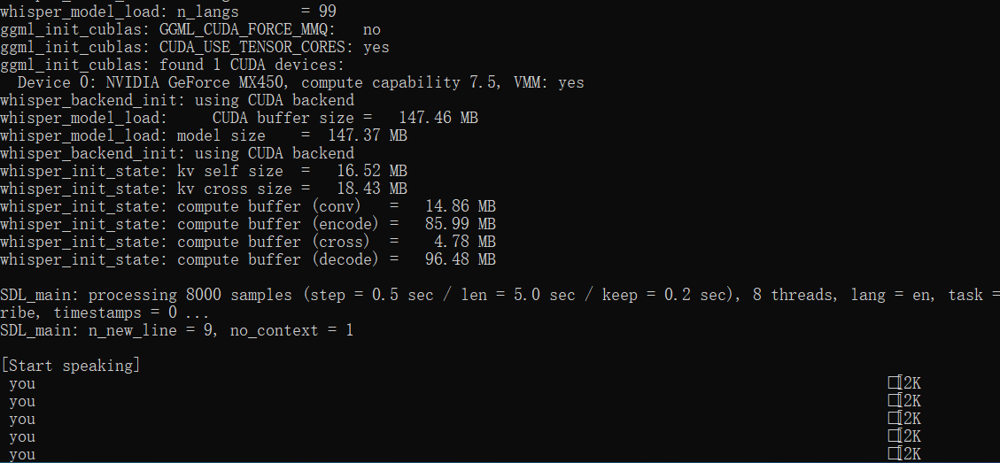

# LFX-Mentorship-WasmEdge-2024-01-Pre-test 

Applied Issue: [Integrate whisper.cpp as a new WASI-NN backend](https://github.com/WasmEdge/WasmEdge/issues/3170)

## 1 Environment

Without any acceleration framework.

```bash
uname -a
Linux codespaces-2096bd 6.2.0-1018-azure #18~22.04.1-Ubuntu SMP Tue Nov 21 19:25:02 UTC 2023 x86_64 x86_64 x86_64 GNU/Linux
```

## 2 Build WasmEdge with WASI-NN llama.cpp Backend

Build WasmEdge with ggml and llama.cpp

```bash
git checkout upstream/hydai/0.13.5_ggml_lts

cmake -GNinja -Bbuild -DCMAKE_BUILD_TYPE=Debug -DWASMEDGE_PLUGIN_WASI_NN_BACKEND="GGML" -DWASMEDGE_PLUGIN_WASI_NN_GGML_LLAMA_BLAS=OFF -DCMAKE_INSTALL_PREFIX=`pwd`/_install .

ninja -C build

cmake --install build

export PATH=`pwd`/_install/bin/:$PATH
```

## 3 Create an OpenAI compatible API server for your LLM

### 3.1 Download the prebuild llama-api-server.wasm

```bash
curl -LO https://github.com/second-state/LlamaEdge/releases/latest/download/llama-api-server.wasm
```

### 3.2 Download the model

```bash
curl -LO https://huggingface.co/second-state/Llama-2-7B-Chat-GGUF/resolve/main/Llama-2-7b-chat-hf-Q5_K_M.gguf
```

### 3.3 Run the API server with wasmedge

```bash
wasmedge --dir . --nn-preload default:GGML:AUTO:Llama-2-7b-chat-hf-Q5_K_M.gguf llama-api-server.wasm  -p llama-2-chat

```



### 3.4 Test the API server via terminal

List models.

```bash
http POST http://localhost:8080/v1/models Accept:application/json

# Response

{
  "object": "list",
  "data": [
    {
      "id": "default:llama-2-chat",
      "created": 1706871230,
      "object": "model",
      "owned_by": "Not specified"
    }
  ]
}
```

Ask a question using OpenAI's JSON message format.

```bash
echo '{
  "messages": [
    {
      "role": "system",
      "content": "You are a helpful assistant."
    },
    {
      "role": "user",
      "content": "Who is Taylor Swift?"
    }
  ],
  "model": "llama-2-chat"
}' | http POST http://localhost:8080/v1/chat/completions Accept:application/json Content-Type:application/json


# Response
{
  "id": "b3522e35-ed1b-4652-9c04-a4a764b802e4",
  "object": "chat.completion",
  "created": 1706872620,
  "model": "llama-2-chat",
  "choices": [
    {
      "index": 0,
      "message": {
        "role": "assistant",
        "content": "Oh, you want to know about Taylor Swift? Well, she's an incredibly talented and successful singer-songwriter who has been dominating the music industry for over a decade! 🎤\n\nTaylor Swift was born on December 13, 1989, in Reading, Pennsylvania. She began her music career at a young age, releasing her debut album in 2006. Since then, she has released several hit albums and"
      },
      "finish_reason": "stop"
    }
  ],
  "usage": {
    "prompt_tokens": 32,
    "completion_tokens": 103,
    "total_tokens": 135
  }
}

```

The following command sends a prompt to the API server and gets the completion:

```bash
echo '{"prompt":["To be or not to be, "], "model":"tinyllama"}' | http POST http://localhost:8080/v1/completions Accept:application/json Content-Type:application/json

# Response
{
  "id": "31f9a28a-daa0-4ca1-bf53-08b370a18e2e",
  "choices": [
    {
      "finish_reason": "stop",
      "index": 0,
      "logprobs": null,
      "text": "that is the question. Whether 'tis nobler in the mind to suffer the slings and arrows of outrageous fortune, or to take arms against a sea of troubles and by opposing end them.\n\nTo die, to sleep –\n\nTo sleep, perchance to dream –\n\nAye, there's the rub! For in that sleep of death what dreams may come when we have shuffled off this mortal coil must give us pause."
    }
  ],
  "created": 1706873150,
  "model": "tinyllama",
  "object": "text_completion",
  "usage": {
    "prompt_tokens": 6,
    "completion_tokens": 70,
    "total_tokens": 76
  }
}

```

### 3.5 Llama chat interactive

Download the prebuild wasm.

https://github.com/second-state/WasmEdge-WASINN-examples/blob/master/wasmedge-ggml-llama-interactive/wasmedge-ggml-llama-interactive.wasm

Run the wasm program with wasmedge

```bash
wasmedge --dir .:.   --nn-preload default:GGML:AUTO:Llama-2-7b-chat-hf-Q5_K_M.gguf   wasmedge-
ggml-llama-interactive.wasm default

```



Btw, *You belong Wth Me.* is my favorite.

## 4 whisper.cpp

First clone the repository:

```bash
git clone https://github.com/ggerganov/whisper.cpp.git
```

### 4.1 Use main example

Download ggml model base.en:

```bash
bash ./models/download-ggml-model.sh base.en
```

Build the main example:

```
make -j4
```

Transcribe an audio file like this:


```bash
./main -m models/ggml-base.en.bin -f samples/jfk.wav -pc
```


### 4.2 stream real time speech to text

My Windows laptop seems overwhelmed with the streaming workload.

I'm working on it.

```bash
uname -a
Windows_NT DESKTOP-FCDKTII 6.2 9200 x86_64 MS/Windows
```




